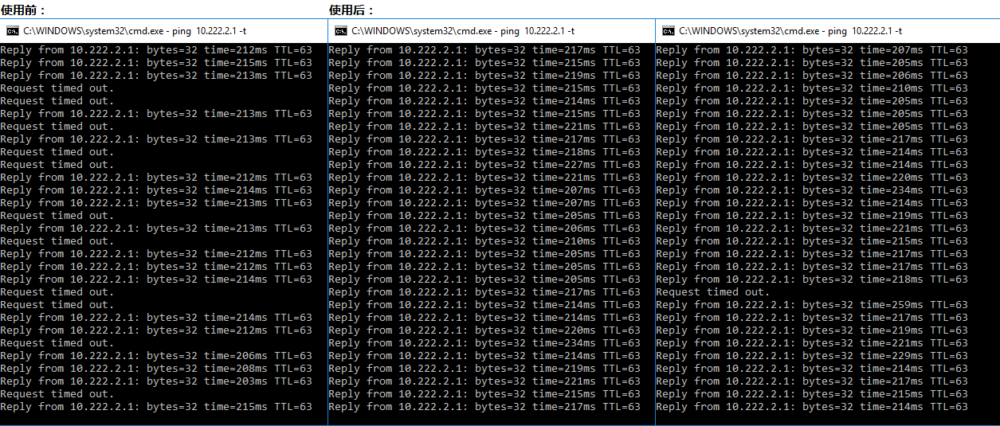
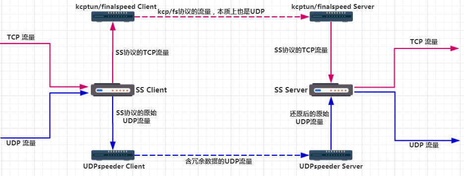

# UDPspeeder

UDP加速工具，降低丢包率，配合vpn可以加速任何协议，尤其适用于加速游戏和网页打开速度；同时也是一个UDP连接的调试和统计工具。

这个是我自己稳定用了一个月的项目，用来加速美服的Brawl Stars和亚服的Mobile Legend，效果不错。
#### 效果

#### 原理简介
目前原理是多倍发包。以后会做各种优化。准备开发的功能有：对高频率的短包先合并再冗余；FEC（Forward Error Correction），在包速低的时候多倍发包，包速高时用FEC。

跟net-speeder比，优势在于client和server会把收到的多余包自动去掉，这个过程对上层透明，没有兼容性问题。而且发出的冗余数据包会做长度和内容的随机化，抓包是看不出发了冗余数据的，所以不用担心vps被封的问题。

每个冗余数据包都是间隔数毫秒（可配置）以后延迟发出的，可以避开中间路由器因为瞬时buffer长度过长而连续丢掉所有副本。

模拟一定的延迟抖动,这样上层应用计算出来的RTT方差会更大，以等待后续冗余包的到达，不至于发生在冗余包到达之前就触发重传的尴尬。

#### 适用场景
绝大部分流量不高的情况。程序本身加速udp，但是配合openvpn可以加速任何流量。网络状况不好时，游戏卡得没法玩，或者网页卡得没法打开，使用起来效果最好。对于解决语音通话的断断续续效果也不错。不适合大流量的场景，比如BT下载和在线看视频。 无论从自己使用效果的角度，还是从国际出口带宽占用的角度，都建议不要在大流量环境使用。

#### 其他功能
输出UDP收发情况报告，可以看出丢包率。

模拟丢包，模拟延迟，模拟jitter。便于通过实验找出应用卡顿的原因。

重复包过滤功能可以关掉，模拟网络本身有重复包的情况。用来测试应用对重复报的支持情况。

client支持多个udp连接，server也支持多个client

目前有amd64,x86,ar71xx的binary

如果你需要绕过UDP屏蔽/QoS，或者需要连接复用/连接保持功能，或者是加密。解决方案在另一个repo(可以跟UDPspeeder一起使用)：

https://github.com/wangyu-/udp2raw-tunnel

# 简明操作说明

### 环境要求
Linux主机，可以使是openwrt路由器，也可以是树莓派。在windows和mac上可以开虚拟机（桥接模式测试可用）。

### 安装
下载编译好的二进制文件，解压到本地和服务器的任意目录。

https://github.com/wangyu-/UDPspeeder/releases

### 运行
假设你有一个server，ip为44.55.66.77，有一个服务监听在udp 7777端口。 假设你需要加速本地到44.55.66.77:7777的流量。
```
在client端运行:
./speeder_ar71xx -l0.0.0.0:3333 -r 44.55.66.77:8855 -c  -d2

在server端运行:
./speeder_amd64 -l0.0.0.0:8855 -r127.0.0.1:7777 -s -d2
```

现在client和server之间建立起了tunnel。想要连接44.55.66.77:7777，只需要连接 127.0.0.1:3333。来回的所有的udp流量会被加速。

注:-d2 表示除了本来的包以外，额外再发2个冗余包。可调。

# 进阶操作说明

### 命令选项
```
UDPspeeder
version: Aug  9 2017 18:13:09
repository: https://github.com/wangyu-/UDPspeeder

usage:
    run as client : ./this_program -c -l local_listen_ip:local_port -r server_ip:server_port  [options]
    run as server : ./this_program -s -l server_listen_ip:server_port -r remote_ip:remote_port  [options]

common option,must be same on both sides:
    -k,--key              <string>        key for simple xor encryption,default:"secret key"
main options:
    -d                    <number>        duplicated packet number, -d 0 means no duplicate. default value:0
    -t                    <number>        duplicated packet delay time, unit: 0.1ms,default value:20(2ms)
    -j                    <number>        simulated jitter.randomly delay first packet for 0~jitter_value*0.1 ms,to
                                          create simulated jitter.default value:0.do not use if you dont
                                          know what it means
    --report              <number>        turn on udp send/recv report,and set a time interval for reporting,unit:s
advanced options:
    -t                    tmin:tmax       simliar to -t above,but delay randomly between tmin and tmax
    -j                    jmin:jmax       simliar to -j above,but create jitter randomly between jmin and jmax
    --random-drop         <number>        simulate packet loss ,unit 0.01%
    -m                    <number>        max pending packets,to prevent the program from eating up all your memory.
other options:
    --log-level           <number>        0:never    1:fatal   2:error   3:warn 
                                          4:info (default)     5:debug   6:trace
    --log-position                        enable file name,function name,line number in log
    --disable-color                       disable log color
    --sock-buf            <number>        buf size for socket,>=10 and <=10240,unit:kbyte,default:512
    -h,--help                             print this help message

```

# 应用

#### UDPspeeder + openvpn加速任何流量
如果你只是需要玩游戏，效果预期会kcp/finalspeed方案更好。可以优化tcp游戏的延迟（通过冗余发包，避免了上层的重传）。比如魔兽世界用的是tcp连接。


跟openvpn via kcptun方式的对比：

kcptun在udp层有RS code，也是一种冗余传输，通过openvpn把流量转成tcp，再通过kcptun加速是有一定效果的。但是tcp只支持按序到达。按序到达的意思是,如果你发了1 2 3 4 5 6 ,6个包，如果第一个包丢了，那么必须等第一个包重传成功以后 2 3 4 5 6 才能到达；只要有一个包不到，后续数据包就要一直等待。用tcp承载udp流量会破坏udp的实时性。会造成游戏卡顿更严重。

udp协议本身是ip协议加上了端口之后的直接封装，udp继承了ip协议的实时/乱序到达特性，更适合中转vpn。

#### UDPspeeder + kcptun/finalspeed同时加速tcp和udp流量
如果你需要用加速的tcp看视频和下载文件，这样效果比vpn方案更好。不论是速度，还是流量的耗费上。


